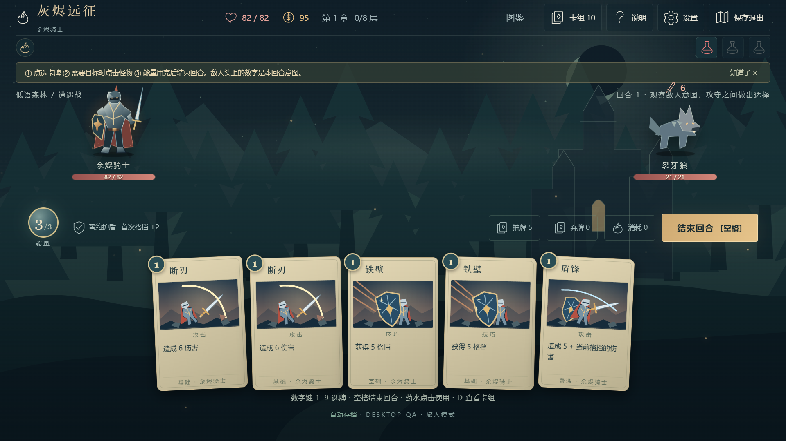
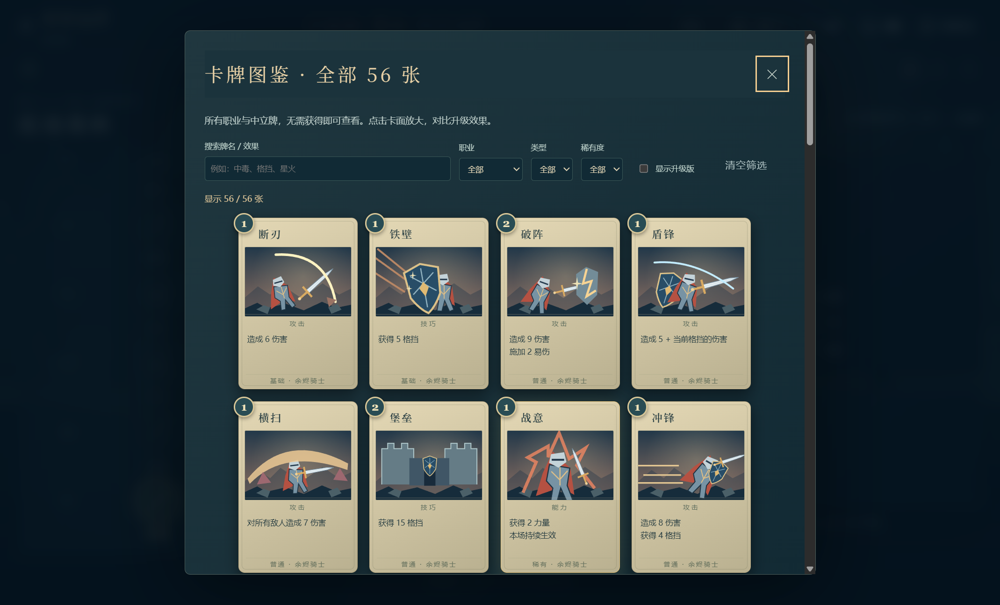
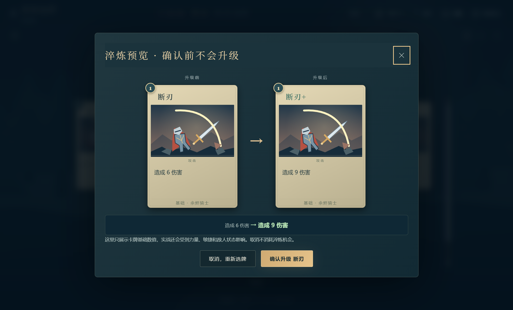

# 灰烬远征 · Emberbound

原创中文单人卡牌肉鸽。三个职业，三章完整远征，56 张逐卡独立场景插画、卡牌图鉴、抽弃牌动画、升级对比、合成配乐，路线地图、遗物、药水、篝火、事件、商店和结局。无需 AI 接口，无 token 开销。Windows 发行包内置运行环境。

这是一款有完整一局流程的小型独立游戏，不是《杀戮尖塔》原版或商业体量的替代品。参考公开的卡牌肉鸽机制；没有使用原作的源码、美术、角色、牌文或声音。

## 开始游玩

[下载 Windows 桌面版](https://github.com/azaz2288/emberbound/releases/latest) · [源码与测试](https://github.com/azaz2288/emberbound)







Windows 桌面版：将 `releases/Emberbound-win32-x64` **整个文件夹**发送给朋友，或发送对应 ZIP。完整解压后双击 `Emberbound.exe`。不要只复制 EXE，旁边的资源和运行库也必须保留。无需安装 Node、Unity 或浏览器，支持离线，F11 全屏。仅适用于 Windows x64，不是 Mac 版。

桌面版使用 Electron 内置 Chromium 渲染，是独立窗口和内置运行时的程序，不是打开浏览器的快捷方式，也不是 Unity 版本。没有代码签名，首次运行可能出现 Windows 未识别发行者提示；不需要管理员权限，不会修改安全设置。

轻量网页版仍保留：Edge/Chrome 打开 `build/Emberbound.html`，一个文件包含全部代码、美术和音效。桌面版和网页版存档互相独立，在设置中导出 / 导入 JSON 即可迁移。不要直接用桌面新存档覆盖网页旧局，导入前先备份。

开发版：已安装 Node 20+ 时，运行 `npm start`，访问 http://127.0.0.1:8787/ 。默认只绑定本机，不暴露到局域网或公网。网页不能简单双击开发版 index.html，因为它使用 ES Modules；请用单文件构建或本地服务器。

### 第一次玩

1. 推荐「旅人 · 轻松」，选择骑士。点击地图上亮起的节点。
2. 战斗每回合有 3 能量。点卡牌；需要目标时点怪物。先看怪物头上本回合要打多少伤害。
3. 格挡在你的下回合开始清空；毒/灼烧能绕过敌人格挡。药水不消耗能量。
4. 结束回合抽新牌。战后新牌可以不拿，保持卡组精简。
5. 篝火回血或升级，商店买牌/遗物/药水或删牌。击败三章 Boss 通关。

快捷键：数字 1–9 出牌；空格结束回合；D 查看卡组；Esc 取消目标、关闭弹窗或暂停。手机窄屏手牌横向滑动，推荐桌面 1280×720 或更大。

### 图鉴与动画（v1.1）

- 主菜单「卡牌图鉴」或游戏顶部「图鉴」：查看所有 56 张牌，按职业、类型、稀有度组合筛选，搜索牌名或效果，切换升级版。点击卡牌放大对比，返回保留筛选。
- 卡组和牌堆里点牌、其他界面右键牌：查看大卡面及基础 / 升级数值，不会出牌或消耗资源。
- 篝火升级：选牌 → 两张大卡并排、变化摘要 → 明确确认；取消保留淬炼机会。
- 开局 / 新回合 / 卡牌效果抽牌会从抽牌堆飞入手牌；回合末剩余手牌飞向弃牌堆；使用后的牌飞向弃牌或消耗堆；抽牌堆耗尽会显示洗回动画。
- 动画结算期间锁定操作，防止重复出牌 / 结束回合；「减少动态效果」可跳过动态表现，不影响规则。
- 音乐默认开启（旧版已关闭设置会保留）；设置里有音量、音乐、效果音和「测试音效」。第一次点击后启动声音；程序不会调整系统音量。

## 内容

- 余烬骑士：首次格挡强化，盾锋、反伤、力量。
- 焰语师：第三张职业法术获得能量/抽牌，灼烧和法术连携。
- 夜行客：第三张攻击全体中毒，零费连击和毒层增殖。
- 56 张原创卡牌（包含 2 诅咒）、16 遗物、4 药水、12 种敌人（含 3 Boss）、5 个多选事件。
- 三章 × 八层，连接式路线图、精英、篝火、事件和行商。
- 三档难度、种子、自存档/继续、JSON 存档导入导出、音量、可关闭声音和动画、历史记录。

## 开发与验证

```powershell
npm test
npm run simulate
npm run build
npm ci
npm run test:desktop
npm run build:desktop
```

游戏逻辑在 `src/engine.mjs`，内容与图鉴筛选在 `src/content.mjs`，56 个独立绘画场景在 `src/card-scenes.mjs`，战斗立绘在 `src/art.mjs`，牌堆动画在 `src/fx.mjs`，界面在 `src/app.mjs` / `style.css`。纯规则与界面隔离；随机种子可重放；存档严格验证牌堆和资源。Node 规则测试无第三方依赖；桌面开发需 npm 下载 Electron 和打包工具（不包含在玩家安装要求中）。

`--self-test` 是仅开发者显式启用的桌面集成检查，使用临时独立用户目录，构造测试局并生成截图与音频验证报告；不用于玩家正常存档。开发版 `--qa` 也使用独立目录。应用限制网络、外部导航和新窗口，禁用 Node 集成，启用沙箱及内容隔离。

开发提示词见 `development_prompt.md`，验证记录见 `verification/README.md`。

## 边界

没有多人联机、AI 自由对话、商业大作的美术和数百小时内容。规则模拟用于回归，不等同于人类趣味测试或完美平衡。遗物/内容暂未做长期扩展和多版本存档迁移。localStorage 是本地便捷存档，不是安全的铁人防作弊存档。

## 许可

源码、程序生成矢量资产、合成音效采用 MIT，见 LICENSE。字体使用操作系统内置字体（未分发字体文件）。所有游戏资源本地；不调用外部 API/CDN。
